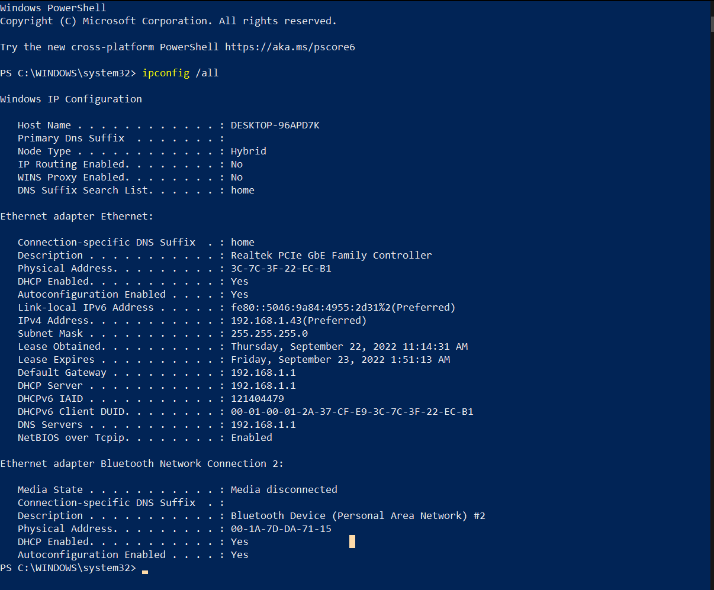
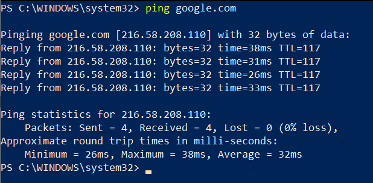
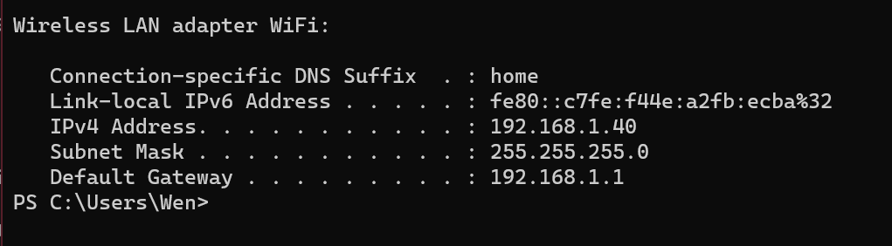
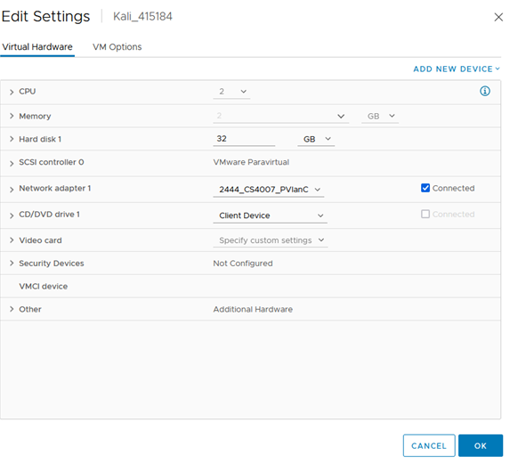
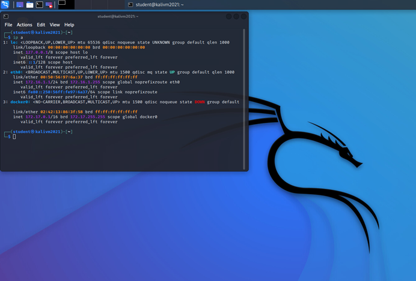
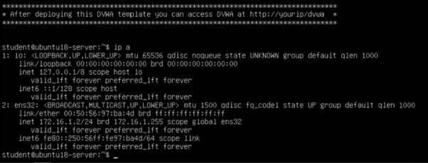
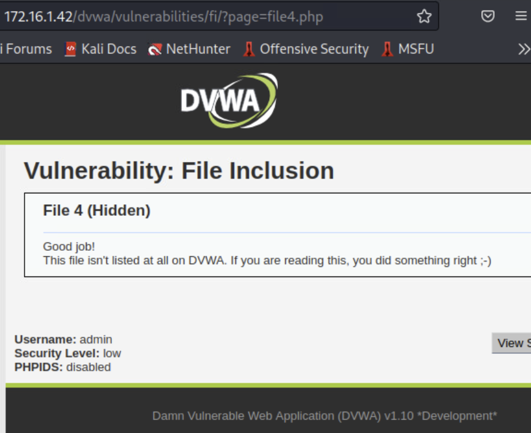
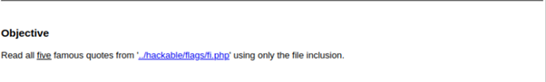
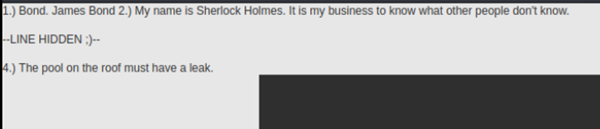

#

# **Cyber Security**

# Body Of Knowledge

Semester 4

Wen Quist

Version 2.0

#

# Table of Contents
1. [Ip configuration](#ip-configuration)
2. [Web shop](#web-shop)
3. [Kali](#kali)
4. [DVWA](#dvwa)
    1. [Path traversal](#path-traversal)
    2. [File inclusion](#file-inclusion)
    3. [Command injection](#command-injection)
6. 
7. [XSS](#xss)
    1. [Stored XSS attack](#stored-xss-attack)

#

## IP configuration

To get an image of how my own network looks like, I looked up my configurations in Windows Powershell. An Ip address is a 32-bit long binary number seperated in four octets and an unique adress connected to individual devices. With an Internet Protocol it's possible to communicate information between systems. Here you can see my desktop and the plugged in bluetooth adapter. 

To make sure the host (my desktop) is properly connected to the internet, I succesfully pinged google.com. 

You can clearly see the ip adress of my desktop is 192.168.1.43 and Routers and switches will see it in binary, which would be: 11000000.10101000.00000001.00101011. To demonstrate how a router works i've also looked up the configuration of my laptop. 

The ip adress of my notebook is 192.168.1.40, so my router is succesfully managing the traffic between other networks and my systems. 

#

## Web shop

To get started we had to set up a test web shop. I created a virtual machine in VMware by using the Kali template. To be able to work in a safe environment we had to connect to our virtual local area network. VLAN divides one physical switch into multiple virtual switches.

#

## Kali

Kali is a very useful operating system for penetration testing. It is open-source and has many tools and features to use for ethical hacking.

#

## DVWA

DVWA is a web application specialized for hackers to improve and test their skills. DVWA has PHP and MySQL embedded to it. PHP is a multipurpose scripting language that can be used to develop dynamic websites without having to add extra files or any data. MySQL is an open-sourced system which manages databases.

I deployed an Ubuntu server with DVWA with a template made by school and connected to it with kali. Because I still need to learn a lot about hacking, I chose the low security level.

#

## Path traversal

Path or directory traversal gives hackers the opportunity to abuse security misconfigurations of a web server. This way hackers can acces databases outside the servers root directory or execute commands. 

#

## File Inclusion

Remote File Inclusion is a way to detect vulnerabilities in web applications that can be exploited. The main goal would be to use a "backdoor" to upload files that contains malware. This way you can sabotage servers

The challenges were to find 5 hidden quotes with file inclusion. At first, I opened all the three files and found one quickly in file 2.

I then thought maybe there was a hidden file, so I changed the URL from 3 to 4: 172.16.1.2/dvwa/vulnerabilities/fi/?page=4.php and did not find a quote but came across this screen.

When you click on view help you can likely see the directory where one of the quotes is stored.

You need to go back twice before the site shows the hidden information.

|**Quotes**| |
|:---------|:---------|
|1| **“I needed a password eight characters long, so I picked Snow White and the Seven Dwarves”**|
|2| **“Bond. James Bond”**|
|3| **“My name is Sherlock Holmes. It is my business to know what other people don’t know”**|
|4|**“The pool on the roof must have a leak”**|

#

## Command injection

#

## XSS

XSS is a form of an attack by injecting mischievous code in a normally trusted web page. Because of the site's security the script will be executed without being detected. Doing this will give the attacker access to cookies, session tokens, sensitive information and even the opportunity to rewrite html code.

#

### Stored XSS Attack
