#

# **Cyber Security**

# Body Of Knowledge

Semester 4

Wen Quist

|Version|Date|
|:---------|:---------|
|**[Version 3.0](https://github.com/wendelaQuist/Cyber_security/commit/fb82209d41633b574a04130e20737af4727451c1)**|**14-10-2022**|
|**[Version 2.0](https://github.com/wendelaQuist/Cyber_security/commit/6aa318c4183d925c0577d6f58fc57dfb46ff460d)**|**30-09-2022**|
|**[Version 1.0](https://github.com/wendelaQuist/Cyber_security/blob/main/Documents/BOK.pdf)**|**16-09-2022**|

#

# Table of Contents
- [**Cyber Security**](#cyber-security)
- [Body Of Knowledge](#body-of-knowledge)
- [Table of Contents](#table-of-contents)
  - [Intro](#intro)
  - [Types of Cyber Security Threats](#types-of-cyber-security-threats)
  - [Web shop](#web-shop)
  - [Kali](#kali)
  - [DVWA](#dvwa)
    - [Path traversal](#path-traversal)
    - [File Inclusion](#file-inclusion)
    - [Command injection](#command-injection)
    - [HIDS](#hids)
    - [SQL injection](#sql-injection)
    - [Blind SQL injection](#blind-sql-injection)
    - [Same-origin policy](#same-origin-policy)
    - [Cookies](#cookies)
    - [XSS](#xss)
    - [DOM XSS](#dom-xss)
    - [Reflected XSS](#reflected-xss)
    - [Stored XSS Attack](#stored-xss-attack)
    - [Cross Domain Acces Controls](#cross-domain-acces-controls)
    - [CSRF](#csrf)
  - [Penetration testing](#penetration-testing)
    - [Pen testing methods](#pen-testing-methods)
  - [GDPR](#gdpr)
  - [IP addresses](#ip-addresses)
  - [IP configuration](#ip-configuration)
  - [Port scanning techniques](#port-scanning-techniques)

#

## Intro
Everyday there is a threat of a cyber invasion going on in the world. Especially Ukraine was a victim of cyber-attacks that targeted important public and private individuals just before the war broke out. These attacks were focussed on ministries, armed forces and banks.

This is why I think it's important to learn more about cyber security to be able to protect yourself as much as you can. This semester I will learn more about diverse security systems, risks, detection and how to defend yourself against an hack. 

In the end I will be able to do a pentest on a company. This will mean detecting possible security threats and being able to report How these threats can be minimized.
#

## Types of Cyber Security Threats

There are a lot of ways to protect yourself, like using a antivirus program, never clicking on suspicious links, not sharing sensitive data, keeping systems up to date and make back-ups frequently. But there are some specialized attacks that require different ways to protect yourself or a company.

|Name|What does it do?|How to stay protected|
|:---------|:---------|:---------|
|Malware|It's a general term for virusses and trojans. Malicious software can be transmitted over an unsecured network and the goal is to corrupt as many machines possible.|To protect yourself from malware it's important to use an antivirus program and be carefull when downloading software.|
|Spam| Spam is unwanted email that is trying to make people click on links to unsecured websites or give up sensitive information. |It's important to look out for hidden hyperlinks that could hide itself as a image for instance. Also never reply to a spam mail. Some anti virus programs use a spam filter.|
|Phishing|Some hackers can pretend to be someone you know or a familiar company, and lure you into clicking on links or giving up private info, like your username and password.| Phishing mails to avoid, use keywords like "urgent" or "immediate action". Most of the times when a hacker is imitating a familiar person the text or email will look odd.|
|Spear Phishing|Instead of sending a general mail to as many people as possible, spear phishing is way more targeted. They usually investigate their target more and try to get high level executives to fall for a scam. An other term is Whaling.| It's very important to encrypt any sensitive company data and to use DMARC. Domain-based Message Authentication, Reporting & Conformance technology verifies if the email adress is stored in the database.|
|Adware|Adware is advertisement pop-ups which trap people into clicking on it. They earn money everytime people click on the link, or by how many times an ad is shown. Adware can track your search history to target and personalize the ads. Once they track your location and browser history, they can sell it to third paries.|When you download software from the internet, make sure you don't install unnecessary additional software.|
|Man-in-the-middle attack|When an end-user is exchanging data with a server a hacker could come in between and pretend to be both to manipulate the transfer and intercept sensitive data or send malicious links.| To prevent MITM attacks, companies could use multi-factor authentication, so an extra security like a personal pin code could help block a hacker.|
|Ransomware| As the name says, ransomware can encrypt or lock important information. It's a way to exploit people and companies for ransom money. It can degrade operations or shut down completely.|Don't plug unkown devices on to your system and use a anti-ransomware software.|
|Denial of Service (DoS and DDoS)|With a DoS attack a server will be flooded with Transmission Control Protocol and User Datagram Protocol packets. DDoS uses a lot of systems to send many packets to one network from multiple locations. By bombarding a server with many packets, it will overload and becomes unavailable. By shutting down servers, companies can lose a lot of money by being unusable untill the servers are up and running again.|It's hard to prevent Dos & DDoS, so it's important to decrease the damage of an attack. By regular network monitoring, It's possible to detect attacks before they take systems offline by not recognizing certain processes.|
|Advanced persistent threats|Instead of obtaining information in a short period of time, APT gaines information over a long period of time. Because it takes so much effort it is usually applied to big targets like, large corporations. This way they can implement malware that can open back doors undetected. Hackers can get more classified information in a matter of time and use it later for exploitation.|APT is very hard to prevent. It's important to use multiple measures from a firewall to spreading awareness of social engineering methods.|

#

## Web shop

To get started we had to set up a test web shop. I created a virtual machine in VMware by using the Kali template. To be able to work in a safe environment we had to connect to our virtual local area network. VLAN divides one physical switch into multiple virtual switches.

Now I had to install Apache, MySQL and PHP.

#

## Kali

Kali is a very useful operating system for penetration testing. It is open-source and has many tools and features to use for ethical hacking.

#

## DVWA

DVWA is a web application specialized for hackers to improve and test their skills. DVWA has PHP and MySQL embedded to it. PHP is a multipurpose scripting language that can be used to develop dynamic websites without having to add extra files or any data. MySQL is an open-sourced system which manages databases.

I deployed an Ubuntu server with DVWA with a template made by school and connected to it with kali. Because I still need to learn a lot about hacking, I chose the low security level.

#

## Path traversal

Path or directory traversal gives hackers the opportunity to abuse security misconfigurations of a web server. This way hackers can acces databases outside the servers root directory or execute commands. 

#

## File Inclusion

Remote File Inclusion is a way to detect vulnerabilities in web applications that can be exploited. The main goal would be to use a "backdoor" to upload files that contains malware. This way you can sabotage servers

The challenges were to find 5 hidden quotes with file inclusion. At first, I opened all the three files and found one quickly in file 2.

I then thought maybe there was a hidden file, so I changed the URL from 3 to 4: 172.16.1.2/dvwa/vulnerabilities/fi/?page=4.php and did not find a quote but came across this screen.

When you click on view help you can likely see the directory where one of the quotes is stored.

You need to go back twice before the site shows the hidden information.

|**Quotes**| |
|:---------|:---------|
|1| **“I needed a password eight characters long, so I picked Snow White and the Seven Dwarves”**|
|2| **“Bond. James Bond”**|
|3| **“My name is Sherlock Holmes. It is my business to know what other people don’t know”**|
|4| **“The pool on the roof must have a leak”**|
|5| **"Line Hidden"**|

#

## Command injection

An unsecured web server can use vulnerable transmissions of data, like cookies and forms. 
Command injections is a cyber attack by using arbitrary code and basically breaching the system and getting acces to private data. There are multiple ways to use command injections such as shell commands or injecting infected files to a server. 

I've entered my ip adress and this way I could acces an external server through an unsecured HTML element. I then implemented PHP code which the web server then executed.

#

## HIDS

Intrusion Detection Systems is a way to monitor network traffic. IDS will receive a copy of all the transferred data and uses signatures to compare normal with hackers activity. This way IDS can alert when there is malicious activity. 

IPS is a physical or virtual prevention system between a firewall and a network port. with the same signature system as IDS but will block the traffic between the router and port.

When an IDS software directly runs on a server , it is an Host intrusion detection/prevention system. Because HIDS operates with a signature-based system it works almost the same as an antivirus and functions as a firewall by looking for a pattern in the data. An anomaly system looks for irregular activity by the user or process

NIDS also surveys network traffic and events like HIDS, but works in a more targeting way by also analysing packet data when it travels through a network.

To keep a company as safe as possible for hackers it would be best to use both HIDS and IPS to complete eachother.

#

## SQL injection

SQL is a common language and it's purpose is to acces or modify databases. SQLI can be used to adjust the backend to display private information, like important business data or sensitive customer info. There are multiple types of SQL injection. With In-band SQLi the hacker launches their attacks through the same way of communication. In-band has two variations:

|Types of SQLi | Explanation |
|:---------|:---------|
| Error-Based SQLi| The attacker sends wrong inputs to create error messages. These errors gives an implication about the structure of a database.|
| Union-based SQLi| The attacker can obtain information from a database by expanding results from the original query. This only works if the new queries have the same structure as the original ones.|

Blind SQL is almost the same as SQL. The main difference is the way data is retreived. With normal SQL a hacker sends inputs to a server which gives an error message back. With blind SQL the hacker doesn't receive any error messages which makes it harder than normal SQL. There are multiple methods you can use with blind SQL.

|Blind SQL methods | Explanation |
|:---------|:---------|
|True/False-based|This way a hacker needs to give statements, if the statement isn't recognized as SQL, it's false and it won't show anything. When the statement is recognized and it's true the database will give up data.|
|Time-based| Some databases use a sleep function. When this function is send to a database and the responses become slow, you know the input is accepted.

#

To practise this I used help, which said I had to get acces to the passwords of 5 users. these users are stored in de database. When you look at the source code, you can see there is no validation which gives me the opportunity to inject lines of code. I looked up what pieces of code I could implement for bypassing the login screen. At first I submitted 1 to 5 to see what pieces of information I have acces to, which were ID, first name and surname. I looked up an cheat-sheet for union attacks from portswigger and inserted ' ORDER BY 1-- , which gave me no error. I replaced 1 for 2 etc. till it gave me an error with 3. This means the passwords are stored in the database and the structure is devided into two columns. I used HackBar add-on for long injection URL to decrypt the password hashes.

I converted these hashes by using crackstation which gave me the passwords of the 5 users.

# Blind SQL injection
The goal is to find out what version the SQL database is running on by executing blind SQL attacks. When I typed 1' and sleep(5)# it took a long time to give me a response, which means the database is vulnerable. Just like SQL it's important to know what the database strucure looks like. To confirm how many columns are present, we can inject 1' order by X#. When I got to fill in three, it gave me the message "User ID is is missing" whcich means the database uses twree columns. 

Now we have to check the length of the database by entering 1' and length(database())=X#. 

#

## Same-origin policy

SOP is an important tool that regulates the way a document or script is loaded and interact. One origin can interact with the recourses of an other origin. 

It's possible for multiple URL's to have the same origin. This means the protocol, port and host would be indentical.

One of the reasons why Internet Explorer isn't safe to use is because it doesn't do same-origin checks. This means there are no restrictions and third parties could get acces between by cross-site scripting.

#

## Cookies

Cookies are text documents with pieces of information that contain the username and password. Browser cookies are very important in the present day, because a server creates the data that is stored in a cookie and attaches a unique ID. When there is an exchange between a server and computer the server will read the ID to confirm the user.  

#

## XSS

XSS is a form of an attack by injecting mischievous Javascript code in a normally trusted web page. It's an end-user attack by basically hijacking the users control. This can happen when a client visits a fake page and leaving credentials or clicking on malicious links. Because of the site's security the script will be executed without being detected. Doing this will give the attacker access to cookies, session tokens, sensitive information and even the opportunity to rewrite html code.

#

## DOM XSS

When a site uses the input from an user to change the dynamic HTML/JavaScript code, it could be exploited to send malicious scripts to the users. One of the most common attacks is to hide JavaScript in the URL, and to be retreived by the page script.  

The goal was to try and steal the cookie from the user. I looked up how the cookie is stored, which is under cookie.document. When you choose a language the URL changes and gives back an default option. 
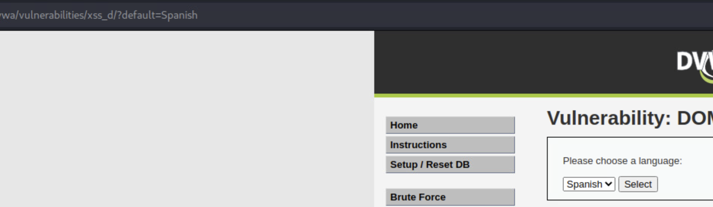
When you add console.log(document.cookie), the console will show the cookie ID.
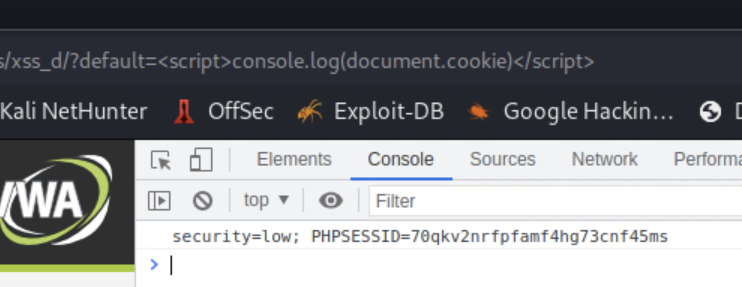

#

## Reflected XSS

 When a server is unsecured enough a hacker could put malicious code into a input field like a login screen and send it to a server. A hacker would try to get the victim to give him/her access by sending phishing mails or creating a fake web page to get to the server. In this case the Hacker would retreive the session identifier to pretend to be the victim. The server will identify the Hacker as the victim and give up privileged data.

Instead of implementing JavaScript into the URL like an DOM based attack, we will send JavaScript code into the text field. Because there is no security, the page will run the script without checking for malicious code.

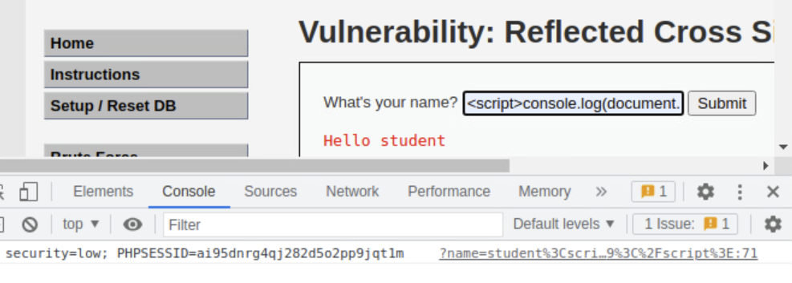

When typing to show console.log(document.cookie) again it will show my session ID.

#

## Stored XSS Attack

When an application is used to store data, it can be compromised by injecting malicous code and storing it on the server. With this method hackers can open backdoors to gain more acces and information, but this will take a long time. In this time hackers can implement backdoors to get deeper into the system and learn more about the vulnerabilities. In the end the client could retreive scripts from the infected server to swap data. Malicious stored code can only be manually deleted or the whole database needs to be resetted. This is a persistent type of attack

By using window.location I can redirect the web page. The best way to test this is to use a local host as redirection. In the terminal I can start an http server on port 1337.

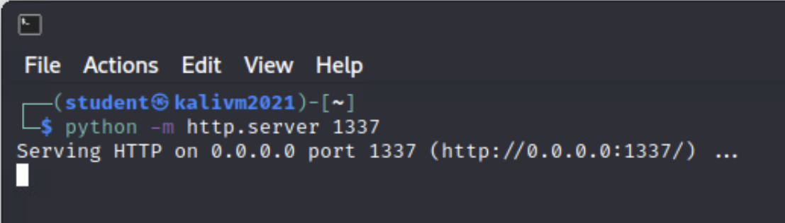

The textfield doesn't have enough characters, so I needed to expand the maxlength in html and inserted location.replace(https://genuine-druid-46cc6f.netlify.app) in the text field. Now when I want to visit the XSS sttored page it keeps redirecting to my web game. To get back to the original page I had to clear my browsing data which deletes history, cookies and cache. Now when I visit the original page my input is still stored, but I'm not being redirected anymore.

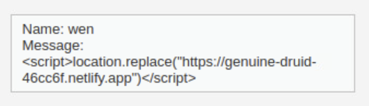

The part HTML I modified to be able to insert more characters isn't being stored, this is why the script won't run but is being saved.
#

## Cross Domain Acces Controls

Some web pages use iframes which integrates one website within another. These sites can't communicate with eachother due to Same-Origin policy. Only when the scheme, port and host are the same, data can be transferred.

#

## CSRF

Cross-site request forgery is a way to partially bypass the Same-Origin Policy. This way hackers can customize requests. This method can cause email adresses and passwords to change to lock the user out, or to completely delete user accounts.  

I had to make sure I could change an users password without showing it to the end-user. Because of the insecurity of the site it will display the password change in the URL after updating it. This means I can run html scripts through the URL. To create a nore realistic scene, I pulled some html and css code to create a fake google page. I edited the code to redirect the link to the Dutch page to DVWA and to execute a password change.

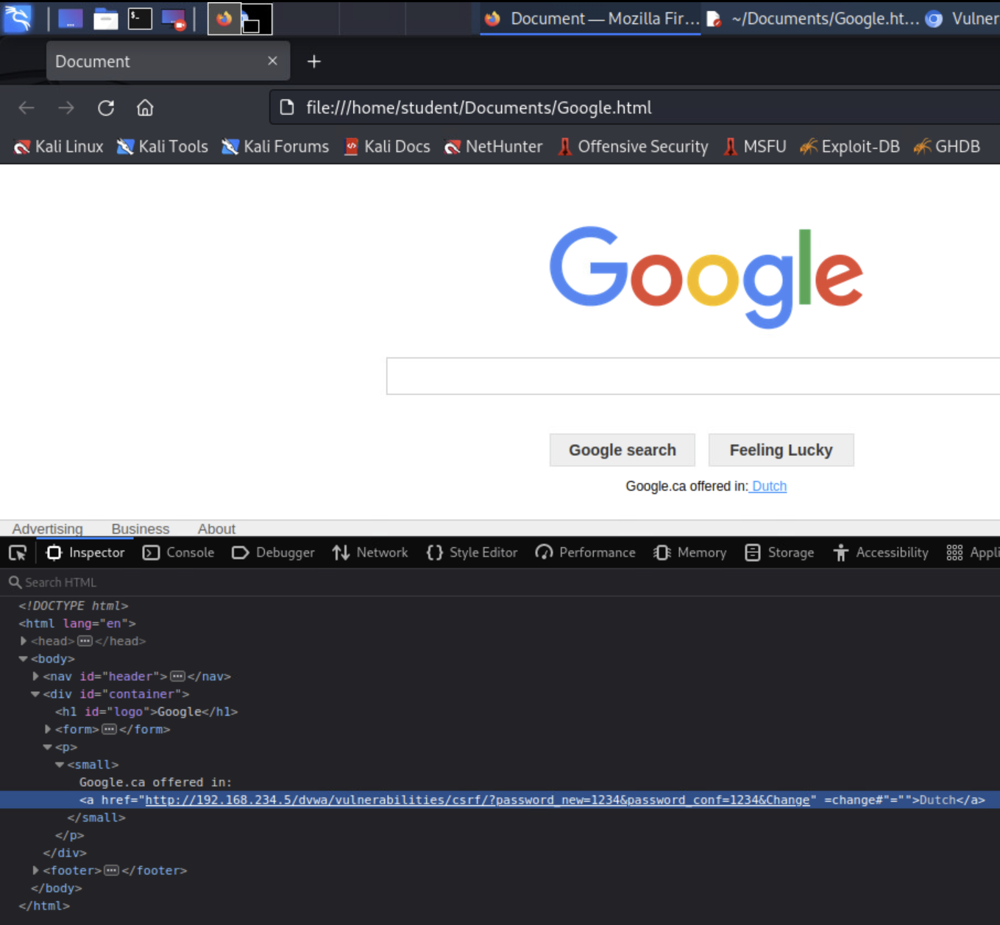

When an user clicks on the link it will unknowingly execute the password change.

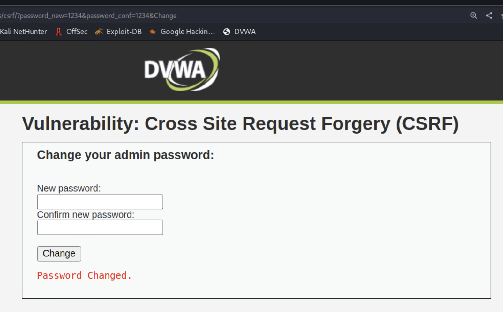

#

## Penetration testing

To detect and resolve high risks in a company, they can choose to be pentested. At first it's important to gather information about vulnerabilities, exploits and weaknesses by executing a **reconnaissance pen test**. This means scanning and/or testing networks, operating systems or other infrastructures to determine what methods we could use to execute the simulated attack. There are two types of scanning, one is **static analysis** where we inspect an application's code to see it's behaviour while performing. The other type of scanning is **dynamic analysis**. Then we will **infiltrate** by cross-site scripting, SQL injection or backdoors so we can traffic unauthorized data and **exfiltrate**. The next step is to maintain access by using the backdoors and trying to gain more acces into the system. This way hackers could try to retreive sensitive company data. Once we found breaches, we have to write down the results in a report containing the specific vulnerabilities that were exploited, the sensitive data we accessed and the amount of time the pentester was undetected in the system.

### Pen testing methods

|Methods| Explanation|
|:---------|:---------|
|External testing|This method consists of targetting vissible parts of an company such as the network, website and email.|
|Internal testing|Internal means the "hacker" tries to simulate an attack inside the sytem and behind the firewall.|
|Blind testing|Blind testing is where the company doesn't tell it's employers about an attack to simulate the most real-life attack.|
|Double-blind testing|Double blind testing is when even the security crew doesn't know about an attack. In the real world they also would not have any prior information about an attack.|
|Targeted testing|When a company performs a targeted test, the employers and the hacker would work together to gain perspective of an hacker.|

#

## GDPR
The General Data Protection Regulation is a very important part of our privacy. GDPR contains rules about the way personal data should be handeled. This regulation forces companies to act attantive and responsible when handeling customer or personell's information. The GDPR also restricts a company from gathering more data than necessary. 

Because of GDPR violations, Office365 is now banned in multiple German regions. This is Because Microsoft has breached the rule about personal data needing to be stored in the same country. Microsoft switched to cloud services which means spreading data on different locations outside the users country.

This is happening because of the, very controversial, US Cloud Act. This means there is **no** protection against citizens from illegitimate searches, seizures and FBI or CIA can get access to personal data without their awareness. 

GDPR and US Cloud Act are very contradictory, because the first is to protect people's privacy as much as possible and the latter is to have open acces to personal data. This makes it very hard for companies in the US and Europe. It has been five years since the Cloud Act and the is still no resolution in sight. 

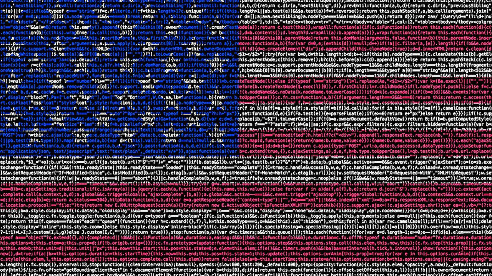

[(Eissler, October 10 2022)](https://techgenix.com/gdpr-microsoft-ban-data-storage/)

#

## IP addresses

Machines that are conncected to the internet need a IP adress to communicate with other systems. Some systems need a particular IP address, so it will be configured with a static IP address. The downside is you have to manually establish  the subnet mask, Default Gateway address, DNS address and maybe more if thats demanded of the host. 

Most modern home networks work with Dynamic Host Configuration Protocol to automatically arrange IP settings. It's more advantageous for Internet providers to have a pool of IP addresses assign them to systems. After some time the assigned IP address will be retreived by the ISP and reassigned to a different machine.

One of the best ways to designate a static IP address to a system, is to create a DHCP reservation. When a specific host requests an IP address the DHCP server will provide the reserved IP address.

Computers make use of two different but equally important IP adresses. The first one is the private IP adress which is used to communicate between machines and the router. Your private IP adress is not vissible on the internet, but your public IP is. An public IP address is used to determines how your router communicates with the word wide web. 

#

## IP configuration

To get an image of how my own network looks like, I looked up my configurations in Windows Powershell. An Ip address is a 32-bit long binary number seperated in four octets and an unique adress connected to individual devices. With an Internet Protocol it's possible to communicate information between systems. Here you can see my desktop and the plugged in bluetooth adapter. 

To make sure the host (my desktop) is properly connected to the internet, I succesfully pinged google.com. 

You can clearly see the ip adress of my desktop is 192.168.1.43 and Routers and switches will see it in binary, which would be: 11000000.10101000.00000001.00101011. To demonstrate how a router works i've also looked up the configuration of my laptop. 

The ip adress of my notebook is 192.168.1.40, so my router is succesfully managing the traffic with DHCP between other networks and my systems. 

#

## Port Scanning Techniques

### ARP
To map the IP address from a system to a physical address or the MAC addres can be done with Address Resolution Protocol. To make a connection between machines, they need the MAC addresses that are located on a Local Area Network. ARP makes sure the devices get their MAC address.

The fisrt step is to take a look at the list of machines which is called an ARP cache. The host will send a request to the router aking all the connected devices who has this IP address and what is the MAC adress. The machine with the matching IP adress will answer with a MAC address.

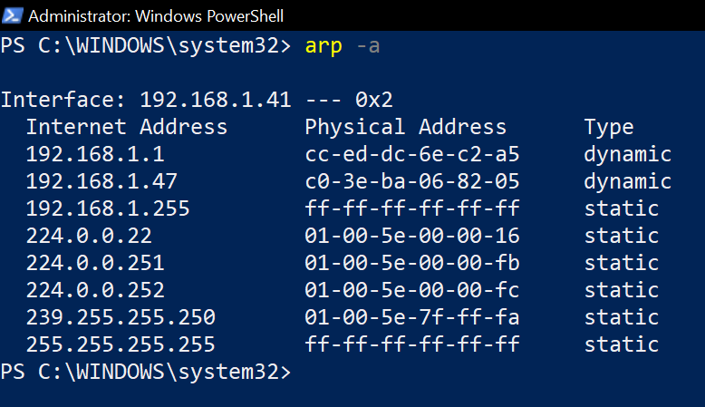

Here you can see a list of devices on my local network that have send a request to my router approximately within the last 60 seconds. Because I have a dual-band router, so I have two broadcast addresses. These addresses can be recognized by the physical address containing only f's.

I started pinging my notebook from my computer and captured the request with wireshark.
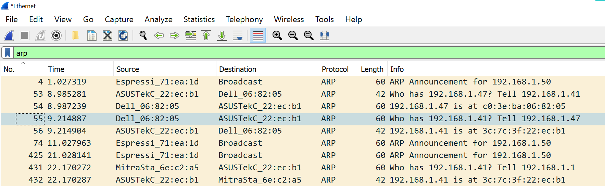

|System | IP address|
|:---------|:---------|
|Desktop|192.168.1.47|
|Notebook|192.168.1.41|

When a computer wants to communicate with a server it will compare the IP address to it's own. When the machine realises the server is not on the same network it will send an ARP request to the default gateway of the router which acts as a door to the internet. If the request is accepted the router will send it's MAC address back to the computer and the IP address of the webserver.

### TCP Connect Scan
To detect if a webserver has any "backdoors" open, it's possible to scan ports to see which are open and closed. I used -sT -p switches to TCP Connect scan the most common webserver ports like 80 and 443 without root privileges. TCP Connect scan uses the TCP three-way handshake to communicate which ports are accessable by sending aknowledgement packages or ACK.

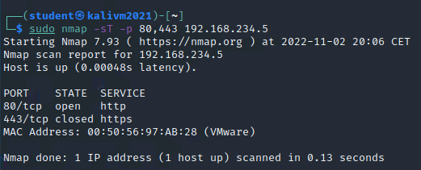

Now we can see port 80 is open. 

We can also scan for open ports in stealth mode by using the -sS switch. SYN scanning is useful if a company uses a IDS system. When we send a request for open open ports it will break off communication while performing the validation. If I open wireshark and scan the whole server for open ports you can see Kali sending and receiving ACKs on which ports. RST stands for reset which means a reset in the middle of a three-way authentication. 

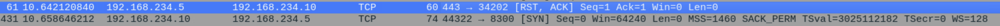

To gain more information about the server like what operation system is being used and what version, we could use -A. With this information we could exploit established weak spots. My server is using Linux version 4.15.

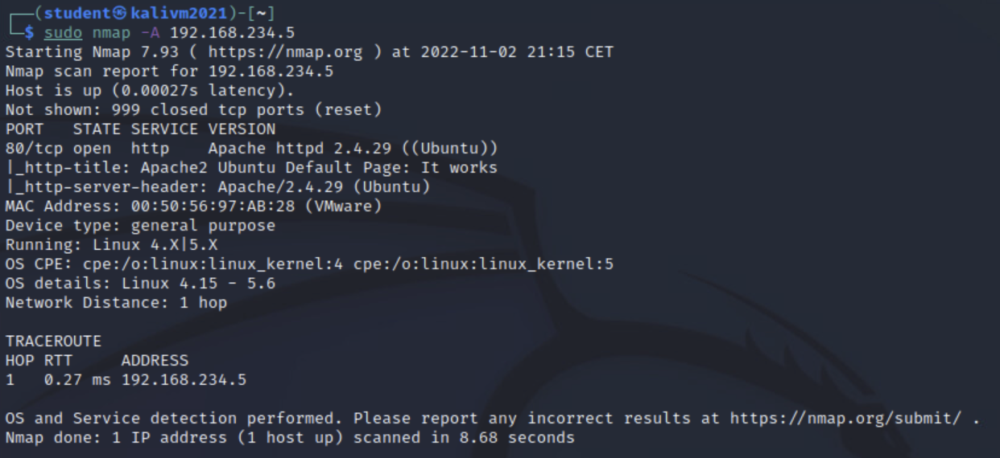

When you're sending these requests, it is possible to be detected by the unusual traffic. This is why you could add fake IP addresses as source by using -D, so security systems would have problems with detecting the real IP address. You can also send scripts to the server with Nmap to detect vulnerabilities. By using the switch --script vuln it will send all these scripts and gives back a report.

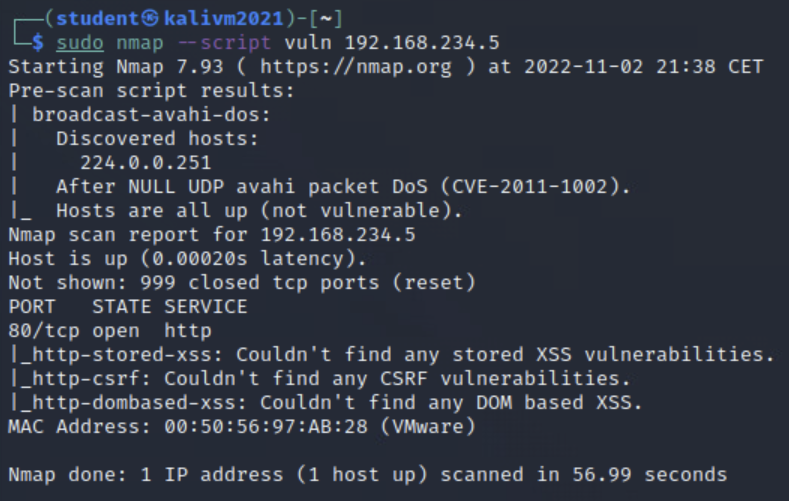

#

## Footprinting, Reconnaissance and Social Engineering

Because protection technology is pretty extensive and secured, human interaction is the biggest security risk. People tend to be less attentive than machines so hackers don't always need advanced hacking techniques for achieving access to a network.

#

Wayback Machine is used to see older versions of websites. Here you can find old data and contact details. I used Nterra, our Pentesting company, to see what the site looked like eight years ago.

V/S now in 2022

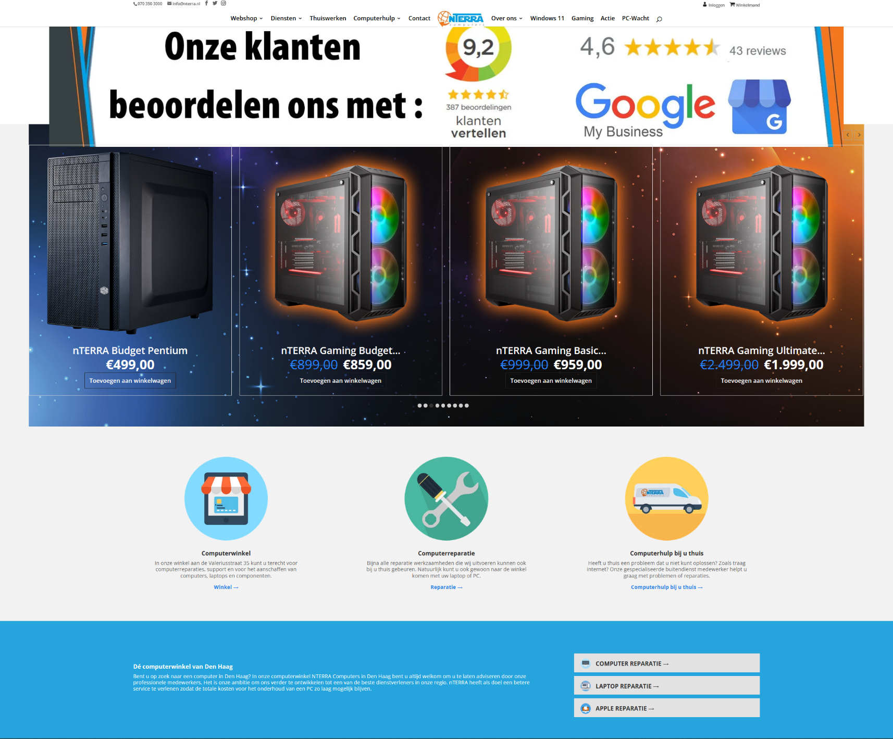

#

When devices communicate with eachother, the packets of information are sent through machines like routers. When these packets are sent between devices it's called a hop. trace routing means I can gather more information about the traffic. I wanted to see the trace routing of Nterra by using the command nmap -sn -Pn --traceroute nterra.nl.

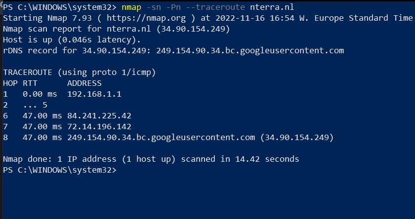

#

A web crawler, spider or search engine bot is able to download and index content from the web. This can be used to gain info about webpages to know what kind of desired information to fetch. To see which URL's can be accessed on a site, A robots.txt file can instruct search engine crawlers and even gain hidden links. If you look at the oficial webpage from the whitehouse and add /robots.txt it will give me a directory to https://www.whitehouse.gov/sitemap_index.xml. When you visit the page it will give a list of hidden URL's like: https://www.whitehouse.gov/briefing-room/presidential-actions/2021/01/20/a-national-day-of-unity/

#

For exploitation you would need also need up-to-date contact details from people. I used SalesQL extension to gather email adresses from LinkedIn.

|Profiles| Company|
|:---------|:---------|
|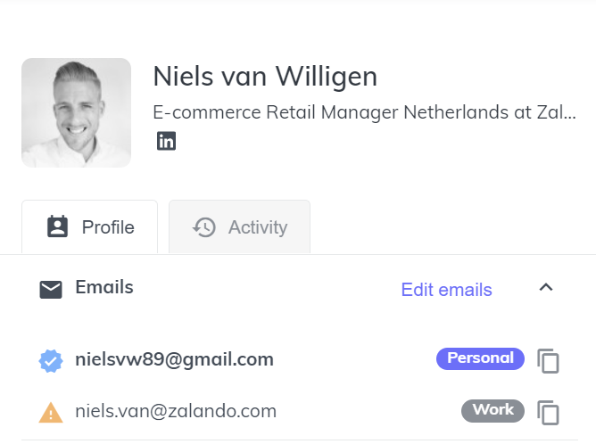|**Zalando**|
||**Google**|
|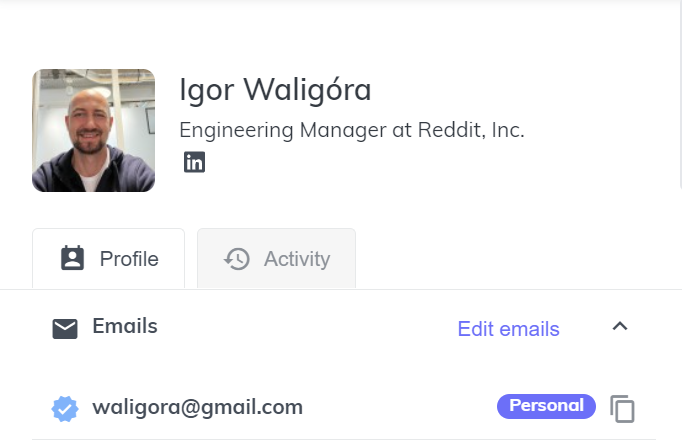|**Reddit**|

#

There are three ways hackers can use social attacks:

1. **Phishing** |
Hackers will send emails that look legitimate from companies to gain trust from unsuspecting people, but have malicious content for people to click on so hackers can gain information like passwords or creditcard details.

2. **Spear phishing** |
This method means the same as "normal phishing" but way more targeted to people. This takes up more time, but is overall more effective than general phishing.

3. **Pretexting** |
Hackers can gain trust if they text people pretending to know them. If people buy it, they will be less attentive and there will be a bigger chance they will give you private information.

### Six principles of influence

|Influence| |
|:---------|:---------|
|Reciprocity|People have the tendency to feel like they have to return any kind of favors to avoid feeling in debt of someone. When a hacker helps someone before trying to gain information, people are more likely to give up passwords etc.|
|Commitment and consitency|If a person is familiar with demands, they are more seemingly to give up previously asked information again. If they already had to provide a password before they will probably give it again.|
|Social proof|People tend to follow leaders or people with credibility over "normal employees". So if someone with a big reputation spreads misinformation, it will result in people following.|
|Liking|When someone seems like a supervisor, friend or a professional because a hacker impersonates them, people are less hesistant to contribute personal information.|
|Authority|In general people are likely to trust to ohters with a high function. A hacker can exploit this trust to get what they want.|
|Scarcity|If someone feels like I need a product now, they think less about security risks and will give up anything to get the product as soon as possible. |