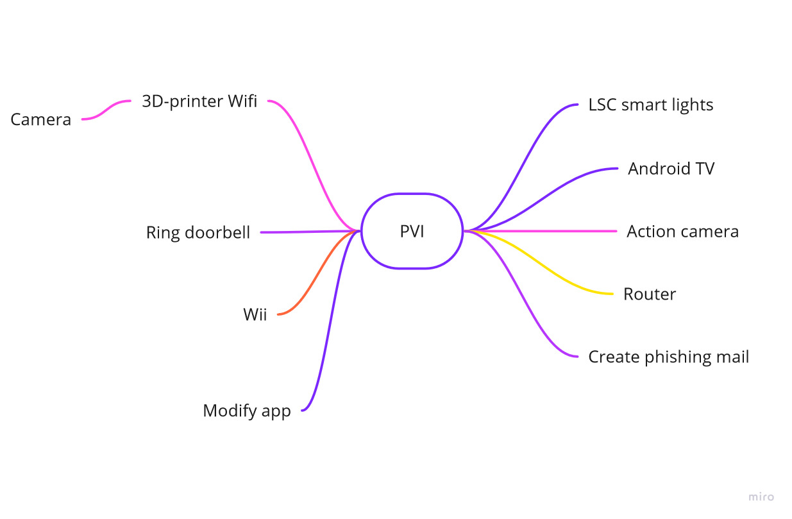
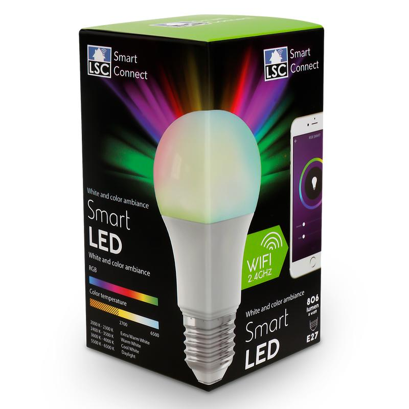
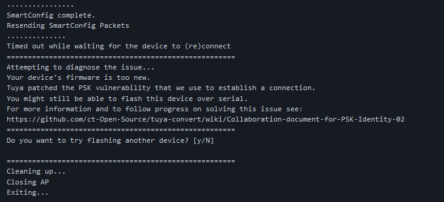
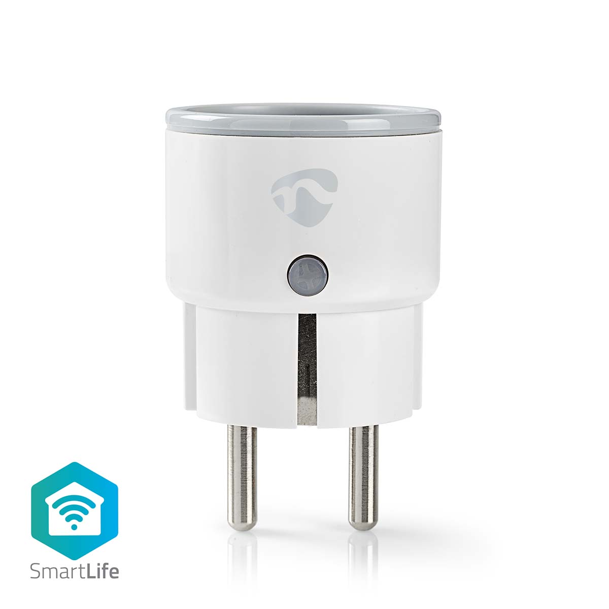
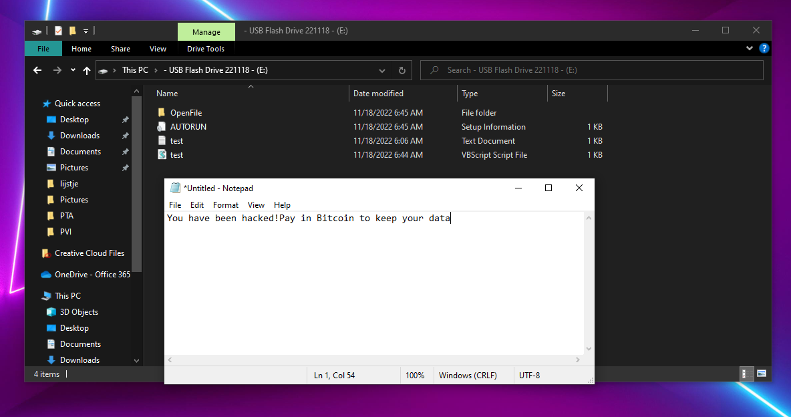
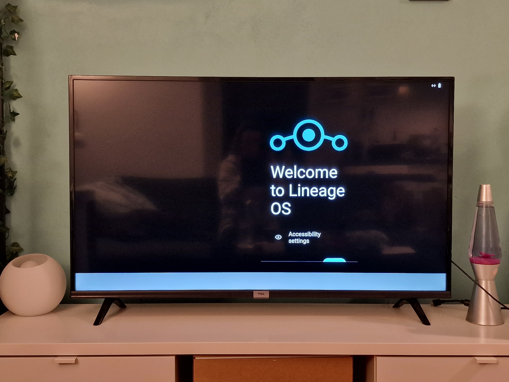
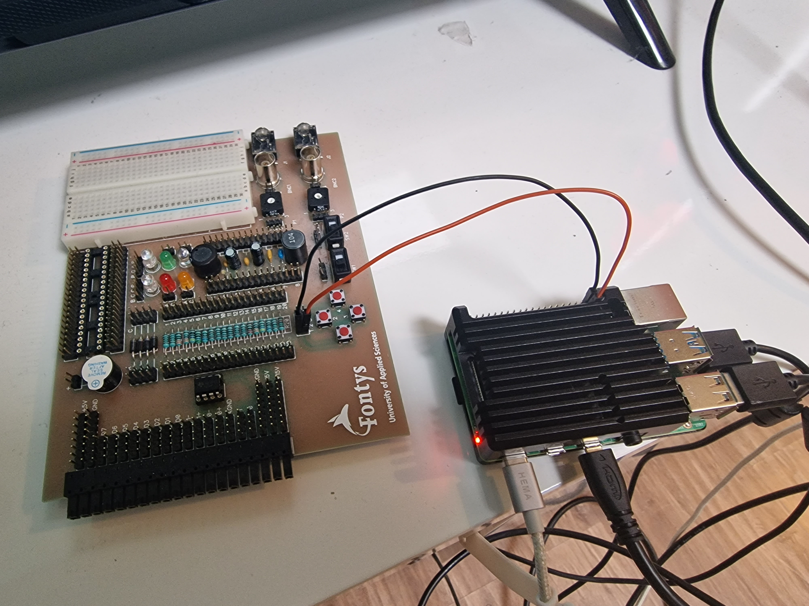
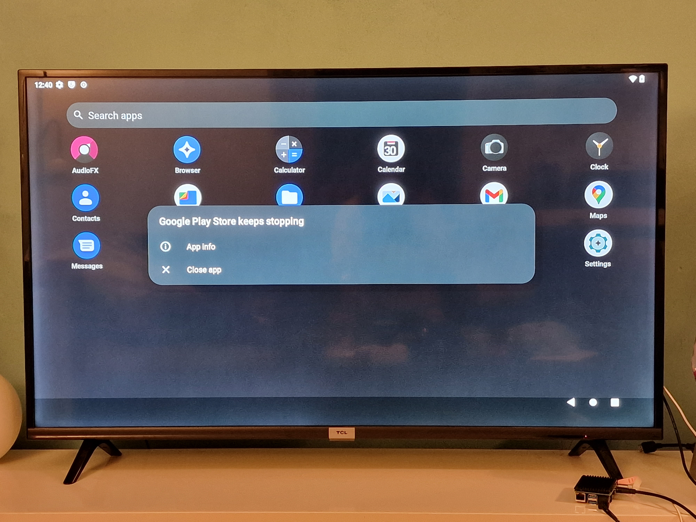
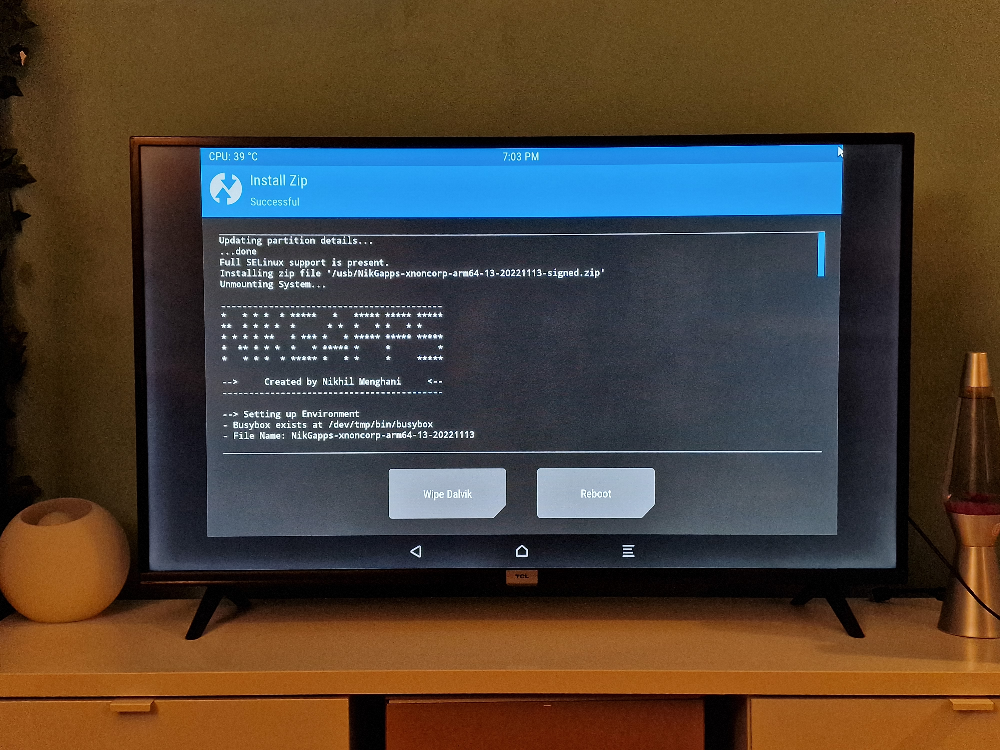

#

# **PVI**

# Table of Contents
- [**PVI**](#pvi)
- [Table of Contents](#table-of-contents)
  - [Intro](#intro)
  - [Brainstorming](#brainstorming)
  - [LSC Smartlight](#lsc-smartlight)
  - [Nedis Smartplug](#nedis-smartplug)
  - [Rubber Ducky](#rubber-ducky)
  - [Android TV](#android-tv)

#

### DOT-framework:
-Literature study

-A/B Testing

-Ideation

-Comparison Chart

## Intro
For my PVI I need to research and investigate technology with possible vulnerabilities. This way I can learn to scan for weak spots in a system. With these weak spots I would be able to give myself deeper acces or modify the software.

#

## Brainstorming
I asked around what kind of project  were going to do, and we gave eachother inspiration. After some ideas I wrote down what I possibly want to research. This means it had to be realistic to achieve, interesting to work with and maybe even usefull. 

After looking into these topics I really wanted to work with my LSC smart lights. In the LSC app you can automate some circumstances, but I'm missing some functions like turning on the lights when i'm close at home and it's dark outside. If I could get acces to the script the lightbulbs are running, I could modify or add code to make te light work as I want to.

#

## LSC Smartlight : How can I customize LSC Firmware?

### System
I did some library research to find out what kind of technology the LSC smart lights use. The smart lights use an ESP8266 Wi-fi microcontroller. This means it could be possible to upload code over wifi if I use an arduino.

The LSC lights from Action belong to a company called Tuya. The lights are connected to a server in China and communicate through my network which is not ideal. If I flash new software to my LSC lights it will overwrite the script to establish a connection with the LSC servers. 

To flash the lights Over The Air, my laptop would need a wifi-adapter who supports Access-Point mode. When I open up device manager and look at my network adapters, I can see that I have a [Qualcomm QCA9377 802.11ac](https://www.qualcomm.com/products/technology/wi-fi/qca9377), but I can't find specifically if it supports AP-mode. Just to be sure I have raspberry pi which definitely can be used as access point.

#

Internet Of Things is a messaging protocol between physical or virtual machines over a network without needing a person to take actions. The requirement of using IoT is the machine needs to have an IP-address. 

MQTT is an common messaging protocol protocol for IoT which is used to authorize communication between devices.

Tasmota is open sourced firmware which can make a back-up and flash the current firmware running on my lights, which is very handy if the flashing goes wrong.  

#

### Execution
I did some research and I should be able to run a raspberry pi with wifi, clone the Tuya-flash git respository and flash my lights. I put my light in pairing mode and started an AP. The lights need to be connected to a network, so when the raspberry is configured as an access point, I need to connect a device with internet to the vtrust network. Tuya flash would search my network for devices and it does connect briefly but then I got an error saying Your device's firmware is too new. I looked for possible solutions but sadly Tuya shared a patch that disables Over The Air flashing. I thought it would be best to downgrade the firmware to an older version, but Tuya also released a patch to prevent older devices from OTA flashing.   

Because this project seems to lead to dead-ends, I decided to move on to find vulnerabilities in my Nedis smartplug, but after researching this product it became clear it runs on the exact same firmware as the LSC lights, so it gave the same error.

#

# Rubber Ducky : How can I execute an malicous script without being detected by the firewall?

I have heard a lot about Rubber Ducky and how powerfull it is, so I decided to get in depth. The Rubber Duckie is a very usefull hacking tool, because when the usb drive is inserted, the computer will perceive it as a keyboard. The firewall won't recognize the USB as harmfull and will alow it to inject keystroke payloads.

I started testing my Rubber Ducky by creating a text file with a simple script that will send an message. When I configure the script to run automatically, I can do a lot.

I used USB Autorun Creater to make sure when the usb stick is plugged in, the script will run automatically.

#

# Android TV : How can I run Android TV on my TCL television.

My TLC was running on its own software with build-in-apps like Netflix and a lot of other unfamiliar ones. The problem was that I also use streaming services like Amazon Prime, Disney plus and Plex which weren't available.  

I did some research and found out that the hardware of my tv isn’t compatible with android tv. This means I can’t flash the firmware or my tv would become completely useless. Because of this I needed to use an external device with an operating system.

To complete my plan, I needed a:
1.	Rasberry pi with Wi-Fi
2.	Micro SD-card
3.	BalenaEtcher
4.	Android TV software
5.	FAT32 USB-stick
6.	Google apps package

For the android TV software I needed a version that's compatible with my raspberry pi. I stumbled across LineageOS which is an open-sourced Android distributer for multiple devices, including mine. With BalenaEtcher, a flashing tool, I was able to write Android 11 safely to my SD card, started it up from my raspberry and put it in developer mode to configure my system.

I noticed from the Frequently Asked Questions, and some comments on the internet that I would need to hardwire a button to function as a power off switch. I couldn't find any loose buttons at home, so I used my old board with soldered buttons on it. I connected the button to the rasberry pi pins, and changed the system settings to enable pin 21 as power button. It worked well until I found other settings to just use a build-in software button.

I wanted to downloaded the google apps package from Opengapps to my USB drive, but I knew the file system of my usb drive was ExFAT which is supported by Windows, but not Android. Thankfully When I plugged the USB, It gave me te option to format it to FAT32, so I downloaded the google files here. I started the Team Win Recovery Project, which is open-source software custom recovery image tool for Android-based devices which gave me the oppertunity to install third-party firmware and back-up the original system. 

I downloaded the google software and Playstore was succesfully installed on my device, but When I wanted to test it if it would work, the app kept crashing, because it was not compatible with my android version or the software was corrupted.

I looked at alternative sites for google app packages and found Nikgapps, which offers a large amount of support and still can receive updates. When I flashed this file it did work really well, and I could connect to the google services and install apps. 

My Rasberry pi gets power from a USB 2.0 port on the TV to USB C. So when powern on my tv, the raspberry pi will automatically start up. Because Netflix doesn't support the hardware of the raspberry, I choose to still use the build-in-app from TCL or switch to Android TV for other apps. I could run Netflix on my raspberry, but after looking into that I could make it work by using Kodi as the operating system and use a Netflix add-on. I have worked with Kodi before and I know what a pain in the ass it is to keep up with updates and to install subtitles, so in the end it was better for me to install the OS on a external device instead of the TV it self.  

